# iPHAsimulator

<p align="center">
  
</p>

**iPHAsimulator** is an open-source Python toolkit for building polyhydroxyalkanoate (PHA) polymer structures and setting up quantum chemistry (DFT) or molecular dynamics (MD) simulations of PHAs.

> **No Python background required** — this guide explains everything from scratch, step by step.

---

## What is iPHAsimulator?

**PHAs (Polyhydroxyalkanoates)** are biodegradable, bio-based polymers with wide applications in packaging, biomedicine, and materials science.

**iPHAsimulator** lets you:
- **Build PHA molecular structures** from simple chemical descriptions (SMILES strings) and generate ready-to-use 3D structure files (PDB format)
- **Parameterise PHA molecules** with the AMBER force field (GAFF/GAFF2) — assigning the correct physics parameters needed for simulation
- **Set up MD simulations** using OpenMM to simulate PHA polymer behaviour at the atomic level
- **Set up DFT quantum chemistry jobs** using ORCA to calculate electronic properties of PHA monomers
- **Analyse simulation results** — radius of gyration, glass transition temperature, diffusion coefficients, and more
- Use **29 pre-built PHA monomer structures** out of the box

The toolkit handles the entire workflow — from a chemical structure name or SMILES string all the way to production-ready simulation files.

---

## Table of Contents

1. [What You Need Before Starting](#1-what-you-need-before-starting)
2. [Installation](#2-installation)
3. [Quick Start (5 minutes)](#3-quick-start-5-minutes)
4. [What is a SMILES String?](#4-what-is-a-smiles-string)
5. [Building PHA Structures](#5-building-pha-structures)
6. [Setting Up Simulations](#6-setting-up-simulations)
7. [Setting Up DFT Calculations](#7-setting-up-dft-calculations)
8. [Analysing Results](#8-analysing-results)
9. [Pre-built PHA Structures](#9-pre-built-pha-structures)
10. [Windows Users](#10-windows-users)
11. [Troubleshooting](#11-troubleshooting)
12. [Contributing](#12-contributing)
13. [Citation](#13-citation)

---

## 1. What You Need Before Starting

iPHAsimulator relies on several scientific software packages. You will need:

| Software | Purpose | Free? |
|---|---|---|
| **Miniconda** | Manages Python and scientific packages | Yes |
| **AmberTools** (antechamber, tleap) | Force field parameterisation | Yes |
| **OpenMM** | MD simulation engine | Yes |
| **RDKit** | Molecular structure handling | Yes |
| **Open Babel** | File format conversion | Yes |
| **ORCA** *(optional)* | DFT quantum chemistry calculations | Free for academics |

> **Windows users**: AmberTools runs on Linux/macOS. On Windows, you must first install **WSL (Windows Subsystem for Linux)**. See [Section 10](#10-windows-users) before continuing.

---

## 2. Installation

### Step 1 — Install Miniconda

Miniconda is a lightweight package manager that will install everything else for you.

**On Linux or macOS**, open a terminal and run:

```bash
cd ~
mkdir -p ~/miniconda3
wget https://repo.anaconda.com/miniconda/Miniconda3-latest-Linux-x86_64.sh -O ~/miniconda3/miniconda.sh
bash ~/miniconda3/miniconda.sh -b -u -p ~/miniconda3
~/miniconda3/bin/conda init bash
~/miniconda3/bin/conda init zsh
```

Then close and reopen your terminal so the changes take effect.

> On macOS (Apple Silicon / M1/M2/M3), replace `Linux-x86_64` with `MacOSX-arm64` in the wget URL above.

### Step 2 — Clone the Repository

Download iPHAsimulator to your computer:

```bash
git clone https://github.com/MMLabCodes/iPHAsimulator.git
cd iPHAsimulator
```

### Step 3 — Create a Conda Environment

A "conda environment" is an isolated container for all the software iPHAsimulator needs — it won't interfere with anything else on your computer.

```bash
conda create --name iphAsimulator python=3.11
conda activate iphAsimulator
```

You will see `(iphAsimulator)` at the start of your terminal prompt — this means the environment is active.

> Every time you open a new terminal, you must run `conda activate iphAsimulator` before using iPHAsimulator.

### Step 4 — Install Dependencies

Install all required scientific packages through conda-forge (the community package repository):

```bash
conda install -c conda-forge ambertools=23 openmm rdkit openbabel mdanalysis numpy pandas scipy matplotlib seaborn scikit-learn
```

This may take several minutes — conda is downloading and configuring everything.

### Step 5 — Install iPHAsimulator

```bash
pip install -e .
```

The `-e` flag installs in "editable" mode, so any changes you make to the code are immediately reflected.

### Step 6 — Verify the Installation

Run these checks to make sure everything is installed correctly:

**Check AmberTools:**
```bash
antechamber
```
You should see a welcome message listing its options. If you get "command not found", AmberTools is not installed — return to Step 4.

```bash
tleap
```
You should see `Welcome to LEaP!`. Press `Ctrl+C` to exit tleap.

**Check Python packages:**
```bash
python -c "import openmm; from rdkit import Chem; import MDAnalysis; print('All packages OK!')"
```

**Check Packmol** (used for building molecular systems):
```bash
which packmol
```
Packmol should be found if AmberTools is installed. Note the path — you will need it later to configure iPHAsimulator.

---

## 3. Quick Start (5 minutes)

Once everything is installed, try these examples to make sure iPHAsimulator works:

```bash
# Navigate to the iPHAsimulator directory
cd iPHAsimulator

# Activate the environment
conda activate iphAsimulator

# Run the examples
python examples/01_hello_pdb.py
python examples/02_smiles_to_structure.py
python examples/03_molecular_properties.py
```

These examples demonstrate loading molecular structures and calculating basic properties. You do not need any simulation files — they work out of the box.

---

## 4. What is a SMILES String?

A **SMILES** (Simplified Molecular-Input Line-Entry System) string is a text representation of a chemical structure. Instead of a 3D model, you write the molecule as a sequence of characters.

Examples:

| Molecule | SMILES |
|---|---|
| Ethanol | `CCO` |
| 3-Hydroxybutyrate (3HB, the most common PHA monomer) | `CC(O)CC(=O)O` |
| 4-Hydroxybutyrate (4HB) | `OCCCCC(=O)O` |

SMILES strings are widely available in online chemical databases such as [PubChem](https://pubchem.ncbi.nlm.nih.gov/). For most PHAs you will work with in iPHAsimulator, SMILES strings are already built in or can be looked up in these databases.

---

## 5. Building PHA Structures

### 5.1 Setting Up a Project Directory

All iPHAsimulator workflows start by creating a **project manager** object that organises your files.

First, locate the `ready_to_run_scripts` folder in the repository root and open:

```
ready_to_run_scripts/1_set_up_project_directory.py
```

In this file, replace the project path with your own:

```python
from modules.filepath_manager import PolySimManage

# Point to your working directory — iPHAsimulator will create the folder structure here
manager = PolySimManage('/path/to/my_pha_project')  # ← change this to your own path
```

Then run the script from the repository root:

```bash
cd iPHAsimulator
python ready_to_run_scripts/1_set_up_project_directory.py
```

This creates the following folder structure automatically:

```
my_pha_project/
├── pdb_files/
│   ├── molecules/       ← 3D structure files for individual molecules
│   ├── systems/         ← assembled polymer systems ready for simulation
│   └── residue_codes.csv  ← a database keeping track of molecule codes
└── python_scripts/      ← a place for your own scripts
```

### 5.2 Building a Single PHA Monomer from SMILES

This step builds a **monomer/repeating unit** from a SMILES string.  
This monomer will later be used for **parameterisation and polymer construction**.

#### Example

```python
from modules.filepath_manager import PolySimManage
from modules.system_builder import BuildAmberSystems

# Initialise project manager
manager = PolySimManage('/path/to/my_pha_project')

# Create a system builder
builder = BuildAmberSystems(manager)

# Define monomer (example: R-3HB)
smiles = "C[C@@H](O)CC(=O)O"   # R-configured 3HB monomer
name   = "3HB"

pdb_path = builder.SmilesToPDB_GenResCode(smiles=smiles, name=name)
print(f"PDB file created: {pdb_path}")
```

---

#### Using the ready-to-run script

You can also run this step using the provided script:

```
ready_to_run_scripts/2_build_monomer.py
```

Open the file and modify:

- `PROJECT_PATH` → use the same path as in Step 5.1  
- `SMILES` → choose your monomer (e.g. 3HB or 3HO)  
- `MOLECULE_NAME` → set a name for your molecule  

---

#### Run the script

From the repository root:

```bash
cd iPHAsimulator
python ready_to_run_scripts/2_build_monomer.py
```

---

#### Output

The generated PDB file will be saved in:

```
my_pha_project/pdb_files/
```

---

#### Notes

- This step builds a **single monomer/repeating unit**, not the full polymer  
- Chirality (R/S) is defined by the SMILES string  
- For R-configured PHA systems, use `[C@@H]` in the SMILES  
- The generated PDB represents an initial 3D structure and will be refined later  

---


### 5.3 Parameterising a Molecule with AMBER Force Fields

Before running an MD simulation, you must assign force field parameters — essentially, the physical rules that govern how atoms move and interact. iPHAsimulator automates this using AMBER's `antechamber` and `tleap` tools.

```python
from modules.filepath_manager import PolySimManage
from modules.system_builder import BuildAmberSystems
from modules.config import create_config_file

# First, tell iPHAsimulator where Packmol is installed (one-time setup)
# You can find the path by running: which packmol
create_config_file(packmol_path='/path/to/packmol')

# Initialise
manager = PolySimManage('/path/to/my_pha_project')
builder = BuildAmberSystems(manager)

# Parameterise the molecule (runs antechamber + tleap automatically)
# This creates .mol2, .frcmod, .prmtop, and .inpcrd files
builder.parameterize_mol(name='3HB', charge=0)
print('Parameterisation complete — AMBER force field files generated.')
```

> **What are .prmtop and .inpcrd files?** These are the two main input files OpenMM needs to run a simulation: `.prmtop` stores the force field topology (bonds, angles, charges), and `.inpcrd` stores the starting atomic coordinates.

### 5.4 Building a Polymer (Homopolymer)

PHAs are polymers — long chains of repeating monomer units. iPHAsimulator can build realistic polymer chains with head, main-chain, and tail residues:

```python
# Build a 3HB decamer (10-unit polymer chain) and a 3x3 array of chains
builder.gen_3_3_array(
    name='3HB',
    n_units=10,         # number of monomer repeat units per chain
    n_chains_x=3,       # chains in x direction (3x3 = 9 chains total)
    n_chains_y=3
)
print('Polymer array system created — ready for MD simulation.')
```

---

## 6. Setting Up Simulations

### 6.1 Running an MD Simulation

Once you have `.prmtop` and `.inpcrd` files from the parameterisation step, you can run molecular dynamics:

```python
from modules.filepath_manager import PolySimManage
from modules.simulation_engine import AmberSimulation

manager = PolySimManage('/path/to/my_pha_project')

# Load the parameterised system
sim = AmberSimulation(
    manager=manager,
    topology_file='/path/to/3HB.prmtop',
    coordinates_file='/path/to/3HB.inpcrd'
)

# Step 1: Energy minimisation — removes any strained geometry
sim.minimize_energy()
print('Energy minimisation done.')

# Step 2: NVT equilibration — heat the system to 298 K at constant volume
sim.basic_NVT(total_steps=500_000, temp=298.15)
print('NVT equilibration done.')

# Step 3: NPT equilibration — equilibrate pressure at 1 bar
sim.basic_NPT(total_steps=1_000_000, temp=298.15, pressure=1.0)
print('NPT equilibration done.')
```

> **Key MD concepts**:
> - **Energy minimisation**: removes clashes and bad geometry before starting dynamics
> - **NVT**: constant Number of particles, Volume, Temperature — good for heating
> - **NPT**: constant Number of particles, Pressure, Temperature — best for production runs

### 6.2 Simulating a Thermal Ramp (for Tg/Tm)

To determine the glass transition temperature (Tg) or melting temperature (Tm) of a PHA polymer:

```python
# Heat from 300 K to 700 K, then cool back to 300 K
sim.thermal_ramp(
    start_temp=300.0,
    end_temp=700.0,
    steps_per_ramp=2_000_000
)
```

### 6.3 Quick Standalone MD Run

For a minimal, standalone simulation without the project manager (uses the command line):

```bash
# Run from the terminal — provide your AMBER files
python python_scripts/simple_md_run.py my_system.prmtop my_system.inpcrd
```

This runs energy minimisation followed by 10,000 NVT steps and saves a PDB trajectory and energy CSV.

---

## 7. Setting Up DFT Calculations

DFT (Density Functional Theory) quantum chemistry calculations require **ORCA** (a separate program, free for academics). iPHAsimulator generates ORCA input files for you.

### 7.1 Generating an ORCA Input File

```python
from modules.system_builder import BuildAmberSystems
from modules.filepath_manager import PolySimManage, DFTManager
from modules.input_generator import DFTInputGenerator

manager = PolySimManage('/path/to/my_pha_project')
builder = BuildAmberSystems(manager)

# Step 1: Convert your PDB to XYZ format (required by ORCA)
builder.PDBToXYZ(name='3HB')

# Step 2: Configure DFT settings
DFTInputGenerator.set_functional('B3LYP')      # Exchange-correlation functional
DFTInputGenerator.set_basis_set('def2-TZVP')   # Basis set
DFTInputGenerator.set_nprocs(8)                # Number of CPU cores

# Step 3: Generate the ORCA .inp file
xyz_path   = '/path/to/3HB.xyz'
inp_path   = '/path/to/3HB.inp'
DFTInputGenerator.generate_input(
    xyz_filepath=xyz_path,
    input_filepath=inp_path,
    filename='3HB'
)
print('ORCA input file created — submit to your HPC cluster or run locally.')
```

### 7.2 Processing DFT Results

After ORCA finishes, iPHAsimulator can read back the results:

```python
from modules.quantum_calculator import csv_to_orca_molecules

# Load ORCA results from a CSV summary file
molecules = csv_to_orca_molecules('/path/to/orca_results.csv')

for mol in molecules:
    print(f'{mol.name}: HOMO-LUMO gap = {mol.homo_lumo_gap:.2f} eV, '
          f'Dipole = {mol.dipole_moment:.2f} Debye')
```

### 7.3 Calculating Partial Charges

Accurate atomic partial charges are essential for force field parameterisation. iPHAsimulator supports multiple methods:

```python
from modules.charge_calculator import ChargeCalculator

calc = ChargeCalculator(
    manager=manager,
    molecule_name='3HB',
    smiles='CC(O)CC(=O)O'
)

# Calculate charges using all supported force field methods (GAFF, GAFF2 with BCC)
calc.calculate_all_semi_charge()

# Optionally use the NAGL machine-learning charge model
calc.calculate_nagl_charge()

# Save and plot results for comparison
calc.save_charges_to_csv()
calc.plot_charges()
```

---

## 8. Analysing Results

### 8.1 Loading a Simulation Trajectory

```python
from modules.filepath_manager import PolySimManage
from modules.trajectory_analyzer import poly_Universe, Analysis

manager = PolySimManage('/path/to/my_pha_project')

# Load the simulation
universe = poly_Universe(
    manager=manager,
    system_name='3HB_3x3_array',
    base_molecule='3HB',
    sim_dir='/path/to/simulation/output'
)

analysis = Analysis(universe)
```

### 8.2 Common Analyses

```python
# Radius of gyration — how compact the polymer is
rog = analysis.plot_ROG(plot=True)

# End-to-end distance distribution
analysis.plot_end_to_end(plot=True)

# Glass transition temperature (Tg) from a thermal ramp trajectory
tg = analysis.get_tg()
print(f'Estimated Tg: {tg:.1f} K')

# Mean squared displacement and self-diffusion coefficient
msd = analysis.plot_MSD(plot=True)
```

---

## 9. Pre-built PHA Structures

iPHAsimulator ships with **30 ready-to-use PHA monomer trimer structures** in the `pdb_files/molecules/` directory. Each trimer is fully parameterised (head · mainchain · tail) and can be used immediately to build polymer chains of any length.

> Naming convention: `3HB` = **3**-**H**ydroxy**B**utyrate · `3HV` = **3**-**H**ydroxy**V**alerate · numbers denote carbon-chain length.

---

### Short-chain-length (SCL) PHAs

These monomers have side chains of 1–2 carbons. 3HB is the most widely studied PHA in nature.

<p align="center">
  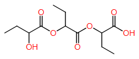
  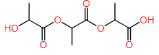
  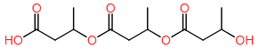
  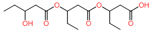
  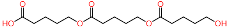
</p>
<p align="center">
  <em>2HB &nbsp;&nbsp;&nbsp; 2HP &nbsp;&nbsp;&nbsp; 3HB &nbsp;&nbsp;&nbsp; 3HV &nbsp;&nbsp;&nbsp; 4HB</em>
</p>

---

### Medium-chain-length (MCL) PHAs

MCL-PHAs have longer aliphatic side chains (≥ 3 carbons) giving softer, more flexible materials.

<p align="center">
  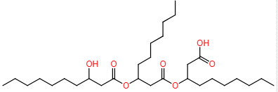
  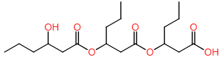
  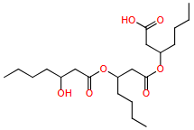
  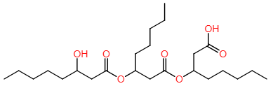
  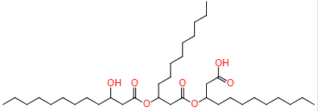
</p>
<p align="center">
  <em>3HD &nbsp;&nbsp;&nbsp; 3HHx &nbsp;&nbsp;&nbsp; 3HHp &nbsp;&nbsp;&nbsp; 3HO &nbsp;&nbsp;&nbsp; 3HDD</em>
</p>

<p align="center">
  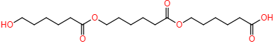
  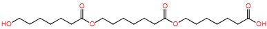
</p>
<p align="center">
  <em>6HHx &nbsp;&nbsp;&nbsp; 7HHp</em>
</p>

---

### Aromatic side-chain PHAs

These monomers carry phenyl, phenoxy, or fluorophenoxy groups, enabling tunable optical and mechanical properties.

<p align="center">
  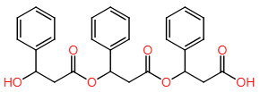
  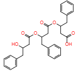
  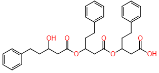
  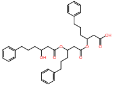
  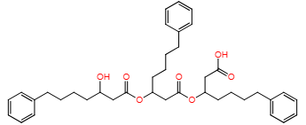
</p>
<p align="center">
  <em>3H3PhP &nbsp;&nbsp;&nbsp; 3H4PhB &nbsp;&nbsp;&nbsp; 3H5PhV &nbsp;&nbsp;&nbsp; 3H6PhHx &nbsp;&nbsp;&nbsp; 3H7PhHp</em>
</p>

<p align="center">
  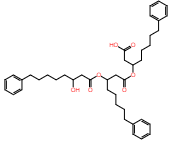
  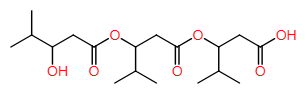
  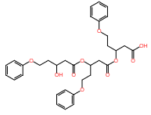
  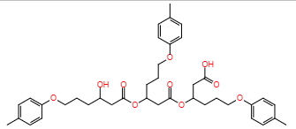
  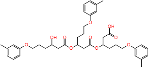
</p>
<p align="center">
  <em>3H8PhO &nbsp;&nbsp;&nbsp; 3H4MeV &nbsp;&nbsp;&nbsp; 3H5PxV &nbsp;&nbsp;&nbsp; 3H6pMPxHx &nbsp;&nbsp;&nbsp; 3H6mMpXHx</em>
</p>

<p align="center">
  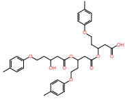
  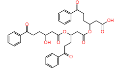
  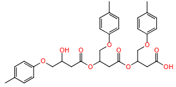
  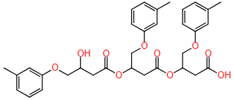
  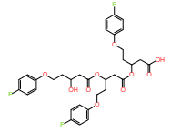
</p>
<p align="center">
  <em>3H5pMePxV &nbsp;&nbsp;&nbsp; 3H5BzV &nbsp;&nbsp;&nbsp; 3H4pMPxPB &nbsp;&nbsp;&nbsp; 3H4mMPxPB &nbsp;&nbsp;&nbsp; 3H5pFPxV</em>
</p>

<p align="center">
  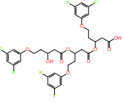
  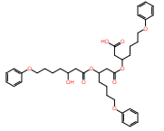
  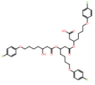
</p>
<p align="center">
  <em>3H5opF2PxV &nbsp;&nbsp;&nbsp; 3H7PxHp &nbsp;&nbsp;&nbsp; 3H7pFPxHP</em>
</p>

---

Each monomer folder (`pdb_files/molecules/<name>_trimer/`) contains the pre-parameterised head · mainchain · tail trimer files that iPHAsimulator uses internally to assemble polymer chains of any length.

---


## 10. Windows Users

AmberTools requires a Linux environment. On Windows, use **WSL (Windows Subsystem for Linux)** to get a Linux terminal inside Windows.

### Setting Up WSL

1. **Enable WSL** — Open PowerShell as Administrator and run:
   ```powershell
   dism.exe /online /enable-feature /featurename:Microsoft-Windows-Subsystem-Linux /all /norestart
   ```

2. **Install Ubuntu** — Visit the [Microsoft Store](https://apps.microsoft.com/search?query=ubuntu) and install Ubuntu.

3. **Launch Ubuntu** and update it:
   ```bash
   sudo apt update && sudo apt upgrade -y
   ```

4. **Follow the normal installation steps** (Section 2) inside your Ubuntu terminal.

> Your Windows files are accessible inside Ubuntu at `/mnt/c/` (for the C: drive). You can work with files in both environments.

---

## 11. Troubleshooting

### "command not found: antechamber" or "command not found: tleap"
AmberTools is not installed or the conda environment is not active. Make sure you run `conda activate iphAsimulator` and that AmberTools was installed in Step 4.

### "ModuleNotFoundError: No module named 'openmm'"
OpenMM is not installed. Run:
```bash
conda install -c conda-forge openmm
```

### "ModuleNotFoundError: No module named 'rdkit'"
RDKit is not installed. Run:
```bash
conda install -c conda-forge rdkit
```

### Packmol path errors during system building
You need to tell iPHAsimulator where Packmol is. Find it with:
```bash
which packmol
```
Then set it:
```python
from modules.config import create_config_file
create_config_file(packmol_path='/path/shown/by/which/packmol')
```

### ORCA not found
ORCA is not part of conda and must be downloaded separately from the [ORCA forum](https://orcaforum.kofo.mpg.de/). Set its path:
```bash
export ORCA_PATH=/path/to/orca
```

---

## 12. Contributing

Contributions are welcome! Whether you are fixing a bug, adding a new PHA monomer, or improving documentation — all contributions make iPHAsimulator better.

**How to contribute:**
1. Fork the repository on GitHub
2. Create a branch: `git checkout -b feature/my-improvement`
3. Make your changes and test them: `python examples/01_hello_pdb.py`
4. Commit: `git commit -m 'Add my improvement'`
5. Push and open a Pull Request

See [CONTRIBUTING.md](CONTRIBUTING.md) for full guidelines.

---

## 13. Citation

If you use iPHAsimulator in your research, please cite:

```bibtex
@software{York2024iPHAsimulator,
  author    = {York, Daniel J. and Vidal-Daza, Isaac and Martin-Martinez, Francisco},
  title     = {iPHAsimulator: A Python Toolkit for Building PHA Structures and Setting Up DFT and MD Simulations},
  year      = {2024},
  url       = {https://github.com/MMLabCodes/iPHAsimulator},
  note      = {Open-source toolkit for polyhydroxyalkanoate molecular simulations}
}
```

---

## Acknowledgements

iPHAsimulator was developed at the **MMlab (Molecular Modelling Lab)** and uses these outstanding open-source tools:

- [OpenMM](https://openmm.org/) — MD simulation engine
- [AmberTools](https://ambermd.org/AmberTools.php) — Force field parameterisation (antechamber, tleap)
- [RDKit](https://www.rdkit.org/) — Cheminformatics
- [Open Babel](http://openbabel.org/) — Chemical file format conversion
- [MDAnalysis](https://www.mdanalysis.org/) — Trajectory analysis
- [ORCA](https://orcaforum.kofo.mpg.de/) — Quantum chemistry calculations (optional)

---

*iPHAsimulator — Making PHA molecular simulation accessible to everyone.*
