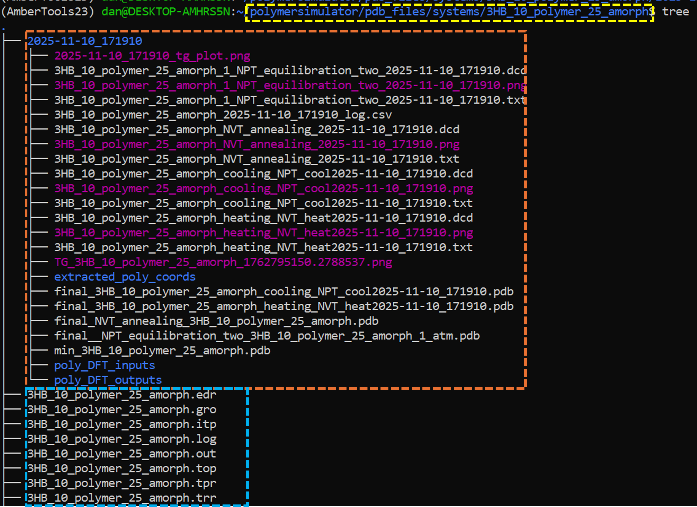
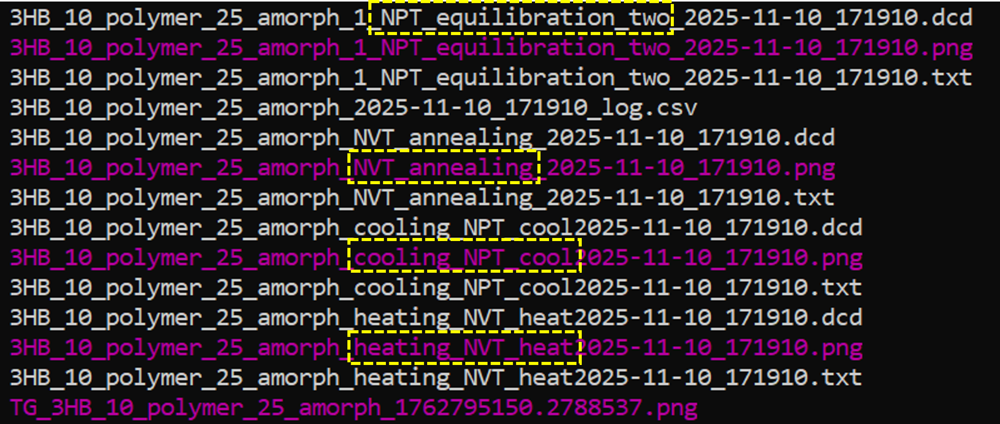

Analysing Polymer Simulations: Walkthrough
===========================================

.. important::
   All notebooks and code should be run from the home directory: **~/iPHAsimulator**.
   Running code from other directories may cause issues with file paths and prevent required Python modules from being loaded.

This guide will cover how to set up and run some pre-defined analysis techniques on a polymer system after an MD simulation. It is also recommended that
you are somewhat familiar with MDAnalysis before utilising this code as it will help you understand any errors and the processes carried out in this guide.

The associated notebooks can be found in the `/tutorials/` folder:
- **Tutorial_10_Analysis_module.ipynb** - Main analysis module tutorial
- **Tutorial_11_Analysis_module_2.ipynb** - Advanced analysis topics

If you are unsure how to launch jupyter notebook, refer to the `installation guide <https://iPHAsimulator.readthedocs.io/en/latest/installation.html#launching-jupyter-notebook>`_.

.. note::
   These analysis methods are optimized for monodisperse homopolymer systems. Support for other types of systems (mixing polymer types and lengths) will be expanded in future releases.

1. Setting up the analysis class
--------------------------------

To begin the workflow, a few modules need to be imported first:

.. code-block:: python

   from modules.filepath_manager import PolySimManage
   from modules.trajectory_analyzer import Analysis, poly_Universe
   import os

**filepath_manager**
   A file and directory manager that can load and save parameters for systems.

**trajectory_analyzer**
   A module containing classes to set up analysis workflows and carry out pre-defined analysis methods.

**os**
   Provides access to file paths and the base directory to initialize the file manager.

2. Initialise Manager and Polymer Universe object
--------------------------------------------------

Now that the modules are loaded, two different classes — **PolySimManage** and **poly_Universe** — are used to create the **manager** and **universe** objects.

.. code-block:: python

   manager = PolySimManage(os.getcwd())

Now the manager object has been set up, the **universe** object is created as a wrapper of a standard MDAnalysis universe. It contains useful attributes specific to this analysis workflow. The many attributes and functions will be detailed further on in this guide.

Required arguments to initialize a universe object:

1. A finished polymer simulation trajectory
2. The name tag associated to the simulation stage you desire to analyse
3. The name of your system
4. The name of your polymer in the system
5. The length of the polymers in the system
6. The type of files the simulation was launched with

As an example, files of a system called **3HB_10_polymer_25_amorph** can be found in the iPHAsimulator repository. This system is:

- 25 3HB decamers
- Amorphous (starting structure generated with Polyply)

Within the standard iPHAsimulator file structure all the files related to this system are found at **~/iPHAsimulator/pdb_files/systems/3HB_10_polymer_25_amorph**. Inside of this folder, various things can be found:

- Topology files
- Coordinate files
- Timestamped folders for any simulations

An example is shown below. Highlighted in blue are the general files for the system (topologies and coordinates); highlighted in orange is a folder for a specific simulation folder containing data files, trajectories and output graphs; highlighted in yellow is the location of this file within the iPHAsimulator file structure.

It is worth explaining some of the files inside the actual simulation folder in a bit more detail:

There are different types of files:

- **.dcd**: trajectory files
- **.png**: output graphs from each simulation stage
- **.txt**: raw data files from each simulation stage
- **.csv**: log file (note: deprecated but kept for reference)

These files all follow a similar naming convention:

- **3HB_10_polymer_25_amorph**: the name of the system
- **"NVT_annealing"**: the simulation stage name
- **2025-11-10_....**: specific timestamp assigned to this simulation (allows replica simulations without overwriting)

The baseline code to initialise an analysis workflow looks like this:

.. code-block:: python

   universe = poly_Universe(manager, system_name, polymer_name, poly_len, sim_stage_name, sim_type, sim_index)

Each of these arguments is explained in the table below:

.. list-table:: Arguments for ``poly_Universe``
   :header-rows: 1
   :widths: 20 80

   * - **Argument**
     - **Description**
   * - ``manager``
     - Manager object.

       EXAMPLE: pre-initialised manager object.

       TYPE: python object
   * - ``system_name``
     - Name of the system.

       EXAMPLE: "3HB_10_polymer_25_amorph".

       TYPE: string
   * - ``polymer_name``
     - Name of the polymer.

       EXAMPLE: "3HB_10_polymer".

       TYPE: string
   * - ``poly_len``
     - Length of the polymer.

       EXAMPLE: 10.

       TYPE: integer
   * - ``sim_stage_name``
     - Name of the simulation stage to be analysed.

       EXAMPLE: "cooling_NPT_cool".

       TYPE: string
   * - ``sim_type``
     - Type of simulation files (AMBER or GROMACS files).

       EXAMPLE: "GRO".

       TYPE: string

       NOTE: types currently supported are "AMB" and "GRO"
   * - ``sim_index``
     - The simulation folder you want to access.

       EXAMPLE: 0.

       TYPE: integer

       NOTE: Useful when you have replica universes; you can use the
       same other arguments but pass 0, 1, 2, ... here to analyse
       different instances of the same simulation.

For the example system, the production run section is "cooling_NPT_cool". The arguments are:

- manager = manager
- system_name = "3HB_10_polymer_25_amorph"
- polymer_name = "3HB_10_polymer"
- poly_len = 10
- sim_stage_name = "cooling_NPT_cool"
- sim_type = "GRO"
- sim_index = 0

And the line of code looks like this:

.. code-block:: python

   universe = poly_Universe(manager=manager, system_name="3HB_10_polymer_25_amorph", polymer_name="3HB_10_polymer", poly_len=10, sim_stage_name="cooling_NPT_cool", sim_type="GRO", sim_index=0)

3. Attributes of a Polymer Universe object
-------------------------------------------

The returned **universe** object has multiple attributes specific to the selected simulation. These are shown in the table below.

.. list-table:: Attributes of a Polymer Universe Object
   :header-rows: 1
   :widths: 25 75

   * - **Attribute**
     - **Description**
   * - ``data``
     - Returns a pandas dataframe of the data from the specific stage selected to be analysed.
   * - ``data_file``
     - Path to the datafile that is used for the pandas dataframe.
   * - ``output_filename``
     - The base filename assigned to any files generated during analysis.
   * - ``sim_stage``
     - The stage of the simulation being analysed.
   * - ``topology``
     - Path to the topology file used to generate the MDAnalysis universe.
   * - ``traj_format``
     - Format of the trajectory file.
   * - ``trajectory``
     - Path to the trajectory file used to generate the MDAnalysis universe.
   * - ``universe``
     - MDAnalysis universe object.
   * - ``select_polymer``
     - Built-in method to select individual polymers from the universe.
   * - ``select_backbone``
     - Built-in method to select individual polymer backbones from the universe.
   * - ``masterclass``
     - An attribute that contains many more attributes (see below).

All of these attributes can be accessed as follows:

.. code-block:: python

   universe.attribute

The **universe.masterclass** attribute has its own set of attributes, that are unique to the system being analysed but are the same across all instances of replica simulations. The attributes for this are listed below.

.. list-table:: Attributes of ``universe.masterclass``
   :header-rows: 1
   :widths: 30 70

   * - **Attribute**
     - **Description**
   * - ``base_molecule_name``
     - Name of the base polymer.
   * - ``base_pdb``
     - Path to the PDB file of the base polymer.
   * - ``base_poly_vol``
     - Volume of the base polymer.
   * - ``calculate_polymers_and_assign_residue_codes``
     - Calculates polymer information and assigns residue codes for analysis identification.
   * - ``extract_rescodes_and_resnums``
     - Extracts residue codes and residue numbers from the simulation topology.
   * - ``group_files``
     - Built-in method that groups simulation stage files.
   * - ``manager``
     - Manager object.
   * - ``min_filepath``
     - Path to minimized structure generated at the beginning of the simulation.
   * - ``number_of_polymers``
     - Number of polymers in the simulation.
   * - ``poly_length``
     - Length of polymers in the simulation.
   * - ``poly_sel_dict``
     - Dictionary of polymer names you can select.
   * - ``polymer_code``
     - Prefix of the polymer name.
   * - ``residue_codes``
     - Residues codes found within the simulation.
   * - ``simulation_directory``
     - Path to the simulation directory.
   * - ``simulation_files``
     - All files found in the simulation directory.
   * - ``simulation_stages``
     - List of potential simulation stages that can be analysed.
   * - ``system_name``
     - Name of the system.
   * - ``system_vol``
     - Approximate volume of all atoms within the system.
   * - ``topology_file``
     - Path to the topology file used in the simulation.

All of these attributes can be accessed as follows:

.. code-block:: python

   universe.masterclass.attribute

.. _polymer-selection:

4. Selecting Individual Polymers
--------------------------------

Being able to select individual polymers is important for analysis. When the universe is initialised, a dictionary is created called the **poly_sel_dict**:

.. code-block:: python

   universe.masterclass.poly_sel_dict

This will return a dictionary with identifiers for each polymer. These identifiers differ depending on whether a GROMACS or AMBER topology was used.

For **GROMACS** topologies:

.. code-block:: python

   {'Polymer_1': 'A',
    'Polymer_2': 'B',
    'Polymer_3': 'C',
    ...}

For **AMBER** topologies:

.. code-block:: python

   {'Polymer_1': [1, 2, 3, 4, 5, 6, 7, 8, 9, 10],
    'Polymer_2': [11, 12, 13, 14, 15, 16, 17, 18, 19, 20],
    'Polymer_3': [21, 22, 23, 24, 25, 26, 27, 28, 29, 30],
    ...}

The table below shows what these identifiers are in terms of MDAnalysis atom selection syntax:

.. list-table:: **Polymer identifier codes**
   :header-rows: 1
   :widths: 20 20

   * - **Topology Type**
     - **Selection Method**
   * - AMBER
     - Resids (all resids of monomers in a polymer)
   * - GROMACS
     - Segids (segid of a polymer)

To select a polymer, use the **select_polymer** method:

.. code-block:: python

   polymer = universe.select_polymer("Polymer_1")
   print(polymer)

Printing this variable will return the same information as printing an MDAnalysis universe.

5. Analysis class
-----------------

The **Analysis** class acts as a library where various predefined methods can be accessed:

.. code-block:: python

   Analysis.some_analysis_method(universe, ...)

Available analysis methods include:

- **plot_ROG** - Calculate and plot radius of gyration
- **plot_ROG_all_polymers** - Plot ROG for all polymers
- **plot_ROG_diff** - Plot ROG fluctuations
- **calculate_tg** - Calculate glass transition temperature
- **calculate_msd** - Calculate mean squared displacement
- **calculate_diffusion_coefficient** - Calculate diffusion properties

For detailed method documentation, see the module docstrings:

.. code-block:: python

   python -c "from modules.trajectory_analyzer import Analysis; help(Analysis)"

5.1 ROG of a single polymer
----------------------------

.. note::
   For thermal cooling simulations, the radius of gyration changes throughout the simulation. The usefulness of this data should be considered based on your simulation type and research goals.

To calculate the radius of gyration of a single polymer, select an atom group first. See the :ref:`polymer selection <polymer-selection>` section for details:

.. code-block:: python

   polymer_1 = universe.select_polymer("Polymer_1")

Then pass it to the **plot_ROG** method:

.. code-block:: python

   avg_rog, rog_values = Analysis.plot_ROG(universe_object=universe, atom_group=polymer_1, plot=False)

This returns:

- The average value of radius of gyration
- A list of all radius of gyration values

To also plot a graph, use the plot parameter:

.. code-block:: python

   avg_rog, rog_values = Analysis.plot_ROG(universe_object=universe, atom_group=polymer_1, atom_group_name="polymer_1", plot=True, graph_filename=None, graph_title=None)

A .png file of the graph will be saved into the simulation folder.

.. image:: images/rog_graph.png

Further analysis can be carried out by cross-referencing this ROG data with other simulation output data to discern conditions where polymers undergo conformational changes.

5.2 ROG of all polymers
-----------------------

The radius of gyration of all polymers within the system can also be plotted on the same graph using **Analysis.plot_ROG_all_polymers**:

.. code-block:: python

   avg_rogs, rog_values = Analysis.plot_ROG_all_polymers(universe_object=universe_object, plot=True)

This plots all the ROG values in the same graph for comparison.

.. image:: images/rog_all_polymer.png

5.3 Fluctuations in ROG of a single polymer
-------------------------------------------

The absolute difference in the ROG of a single polymer can also be plotted using **Analysis.plot_ROG_diff**:

.. code-block:: python

   rog_fluctuations = Analysis.plot_ROG_diff(universe_object=universe, atom_group=polymer_1, atom_group_name="polymer_1", plot=True, graph_filename=None, graph_title=None)

This returns a list of fluctuations between each datapoint.

.. image:: images/rog_diff.png

---

**For more analysis methods and advanced usage**, please refer to the tutorial notebooks:

- Tutorial_10_Analysis_module.ipynb - Standard analysis workflows
- Tutorial_11_Analysis_module_2.ipynb - Advanced analysis techniques

For complete API documentation, see the module docstrings in `modules.trajectory_analyzer`.
